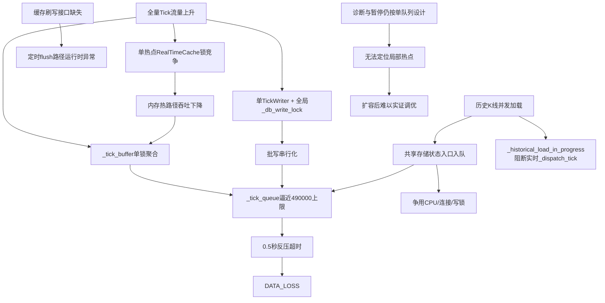
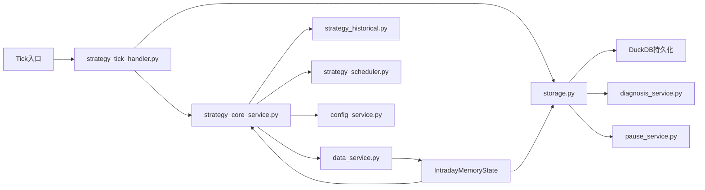

# 16+6+1+1 内存优先架构优化方案（12原则版）

> 版本: v1.1\
> 日期: 2026-04-30\
> 适用对象: 16+6+1+1 架构改造评审、实施前审查、实施执行\
> 关联文档: [16+6+1+1架构限制点盘点与改造蓝图\_20260429.md](./16+6+1+1架构限制点盘点与改造蓝图_20260429.md), [16+6+1+1架构限制点盘点核查验证报告\_20260429.md](./16+6+1+1架构限制点盘点核查验证报告_20260429.md), [修改必须遵守的12原则.md](./修改必须遵守的12原则.md)

***

## 1. 文档定位

本文件是“正式优化方案书”，用途不是重复前一份蓝图报告，而是把后续代码改造严格收束到 12 原则要求的格式中。

本文件确认以下边界：

1. 本次交付是分析报告和详细修改方案，不是代码实施完成报告。
2. 在本文件被评审确认之前，不应进入代码改造阶段。
3. 后续任何代码实施都必须以“当日数据与当日计算在内存中完成”为第一原则。
4. 后续任何代码实施都不得破坏四唯一原则。
5. 当前内存更多是“缓存”和“缓冲”，必须升级成“全量安全承接层”，这是 16+6+1+1 架构成功的前提条件，不满足这一点，多通道扩容仍会退化为排队后丢弃。

***

## 2. 12原则遵守声明

### 2.1 对原则1的落实

本文件已经补齐原则1要求的核心内容：

1. 问题现象描述
2. 根因分析
3. 原因地图
4. 影响范围地图
5. 模块文件与问题行号
6. 成功修复标准
7. 验证方法
8. 彻底性保证
9. 预防隐患
10. 修改操作与回退安排

### 2.2 对原则2的落实

本方案把四唯一约束单独列为实施闸门：

1. ID 唯一: 不新增第二套 instrument\_id / internal\_id 语义
2. 接口唯一: 不为相同存储功能保留新旧双接口并存
3. 渠道唯一: Tick 主链路仍保持唯一主通道，不允许旁路直写
4. 方法唯一: 分片、spill、回放各自只保留一种正式实现

### 2.3 对原则3至12的落实

本方案在后续章节中分别落实：

1. 备份与行数监控
2. 小模块边界控制
3. 新模块审批边界
4. 根因一次修复
5. 代码精简
6. 影响范围控制
7. 验证与回退
8. 成功标准
9. 实证验证
10. 确定性交付

***

## 3. 已确认的问题现象

以下结论来自已审阅的代码与日志证据，不是推测：

1. Tick 写入当前只有一个实时写线程，且 Tick 队列上限是 490000，K 线队列上限是 10000，代码见 [storage.py](../storage.py#L54-L80)。
2. 先前蓝图文档中关于 “Tick 25 万、K 线 50 万” 的队列基准已经被核查报告纠正；后续实施必须以当前真实值为准，而不是沿用旧值。
3. Tick 落库存在全局串行锁，代码见 [storage.py](../storage.py#L95-L96) 和 [storage.py](../storage.py#L373-L392)。
4. RealTimeCache 仍是单锁热点，代码见 [data\_service.py](../data_service.py#L28-L106)。
5. 历史 K 线加载当前和实时写链路耦合，且配置存在 max\_workers 漂移；同时当前默认 delay 已是 `history_load_batch_delay_sec=0.2`、`history_load_request_delay_sec=0.1`，不是旧文档中的 0.05 和 0.03，代码见 [config\_service.py](../config_service.py#L1344-L1350) 和 [strategy\_historical.py](../strategy_historical.py#L506-L514)。
6. 当前真实数据流不是单层缓冲，而是 `Tick入口 -> _tick_buffer(50条/5秒) -> storage.process_tick() -> _tick_queue(490000) -> TickWriter -> DuckDB`，代码见 [strategy\_tick\_handler.py](../strategy_tick_handler.py#L65-L66)、[strategy\_tick\_handler.py](../strategy_tick_handler.py#L526-L555)、[storage.py](../storage.py#L74-L80)。
7. 历史加载期间，`_historical_load_in_progress` 会阻断实时 Tick 的 `_dispatch_tick()`，代码见 [strategy\_tick\_handler.py](../strategy_tick_handler.py#L304)。
8. 定时缓存刷写路径调用了当前主代码中不存在的方法 `batch_insert_from_cache` 和 `truncate_wal`，代码见 [strategy\_scheduler.py](../strategy_scheduler.py#L528-L533)；这属于必须纳入方案的 P0 运行时缺口。
9. 诊断与暂停链路仍然按旧单队列假设工作，代码见 [diagnosis\_service.py](../diagnosis_service.py#L2167-L2171)、[diagnosis\_service.py](../diagnosis_service.py#L2368-L2371)、[pause\_service.py](../pause_service.py#L382-L405)。

***

## 4. 根因分析

### 4.1 一级根因

1. 当前架构把“内存状态集合、入队缓冲、异步持久化、历史回补、诊断统计”压在了少数共享状态承载点上。
2. 这些共享状态承载点内部仍保留双层缓冲未分片、单热点锁、单口径统计、旧路由规则等旧设计。
3. 因此，系统在压力上升时会先在内存热路径和队列反压处失稳，而不是在磁盘容量上失稳。
4. 更本质地说，当前内存层还不是“全量安全承接层”，而只是“缓存和缓冲的混合体”，所以入口大于出口时，系统仍会在有限队列处丢失 Tick。

### 4.2 二级根因

1. 存储主链路没有完成 shard 化，Tick 入口与 Tick 写入的并发能力不匹配。
2. DuckDB 在当前设计中承担了过多热路径压力，而不是退居异步持久化层。
3. 当日运行状态尚未形成完整内存状态集合，更没有形成“全量安全承接层”，64G 内存优势没有被架构化使用。
4. 诊断、暂停、E2E 计数器仍是单桶思路，导致扩容后难以实证验证。
5. 定时缓存刷写与实时持久化之间存在断裂接口，导致恢复链路并不闭环。

### 4.3 三级根因

1. `strategy_tick_handler.py` 先使用全局 `_tick_buffer` 聚合，再把数据送入 `storage.py`，第一层缓冲未分片。
2. `storage.py` 把 queue、writer、lock、shutdown、stats 全部硬编码到固定字段。
3. `data_service.py` 的缓存与连接配置仍服务于旧双通道模型，且缓存刷写缺少现行实现。
4. `strategy_historical.py` 通过统一存储状态入口入队，且历史加载期间可直接阻断实时 `_dispatch_tick()`。
5. `diagnosis_service.py` 和 `pause_service.py` 仍保留旧 `_write_queue`/汇总 backlog 语义。

### 4.4 前提结论: 内存层必须从缓存/缓冲升级为全量安全承接层

本方案确认以下判断为实施前提：

1. 当前内存层只能算“缓存和缓冲”，不能算“全量安全承接层”。
2. 只要内存层不是全量安全承接层，入口高于出口时，丢失就仍会在 `_tick_buffer`、`_tick_queue` 或其下游反压点发生。
3. 16+6+1+1 的真正目标，不只是把单队列改成多队列，而是让内存层先完整、安全、可恢复地承接当日全量实时数据，再由后端异步持久化。
4. 因此，“把当前内存从缓存/缓冲优化为全量安全承接层”不是附属优化，而是 16+6+1+1 成功的硬前提。

***

## 5. 原因地图（Root Cause Map）

***

## 6. 影响范围地图（Impact Map）

受影响的功能链路分为 6 组：

1. Tick 实时入口链路
2. 当日内存状态链路
3. 异步持久化链路
4. 历史 K 线加载链路
5. 诊断与暂停链路
6. 测试与验收链路

***

## 7. 四唯一原则检查

### 7.1 ID唯一

禁止事项：

1. 不新增第二套 Tick shard 专用 instrument\_id。
2. 不把 internal\_id、instrument\_id、future\_code 再次做二次标准化。
3. spill/replay 不得重写业务 ID，只能附加技术元数据。

补充约束：

1. 后续若细化 IntradayMemoryState，只允许做“状态分区”或“状态视图”拆分，不允许做第二套 ID 分层。
2. `latest`、`recent window`、`pending persist`、`spill index`、`snapshot` 这些状态集合如果存在，必须全部使用同一套直通 ID 作为键。
3. 不允许因为做内存承接层而引入新的 `memory_id`、`shard_local_id`、`snapshot_id` 一类业务替代 ID。
4. shard 只能是路由属性，不能成为替代业务主键。

### 7.2 接口唯一

正式接口建议收敛为：

1. Tick 实时写入口只保留一个正式接口。
2. K 线历史入队只保留一个正式接口。
3. shard 路由只保留一个正式策略函数。
4. queue stats 只保留一个统一出口。

### 7.3 渠道唯一

正式传递路径应为：

1. Tick 到达
2. 先进入唯一的 shard 化 Tick 缓冲层
3. 再写 IntradayMemoryState
4. 再进行策略/风控计算
5. 再进入 Tick shard queue
6. 最后异步持久化或 spill

不允许新增以下旁路：

1. 策略逻辑直接查 DuckDB 补热路径状态
2. 诊断模块直接扫描底层私有队列替代统一 stats 接口
3. 历史 K 线绕过 K 线 writer 直接共用 Tick 写路径

### 7.4 方法唯一

必须强制单方案的内容：

1. Tick shard 规则只允许一种 hash 路由算法
2. spill 落盘格式只允许一种实现口径
3. replay 顺序恢复只允许一种实现口径
4. 当日内存状态只允许一个权威主状态集合
5. 内存状态拆分只允许一种正式建模方式：基于同一套直通 ID 的状态分区，而不是多套状态集合各自维护不同 ID

***

## 8. 优化目标与成功标准

### 8.1 总体目标

1. 当日数据与计算默认在内存状态集合完成。
2. Tick 主链路扩展到 16 逻辑 shard + 6 Tick writer。
3. K 线与 Tick 完全隔离。
4. 持久化拥塞不应破坏策略当日主运行态。
5. 双层缓冲必须一起 shard 化，不能只改第二层 `_tick_queue`。
6. 缓存刷写断裂和错误路由必须在本轮方案中一并收口。

### 8.2 量化成功标准

1. 全量订阅时实时 Tick `drops_count == 0`。
2. 定时缓存刷写路径不再触发 `AttributeError`。
3. signal/depth/snapshot 路由不再被旧前缀规则误分流。
4. 历史回补开启时，实时 Tick 主链路不再被硬阻断。
5. DuckDB 出现瞬时抖动时，策略主逻辑仍保持连续运行。

### 8.3 最新运行证据下的决策补充

本节用于吸收 2026-04-29 22:53 到 23:45 这次真实运行的最新结论，防止后续评审再次把“大队列未显性丢 Tick”误解成“单通道已足够”。

1. [strategy.log](../logs/strategy.log#L388422) 到 [strategy.log](../logs/strategy.log#L388429) 显示，22:53:42 首次 20 合约诊断即出现无 Tick 数据，且 TickEntry、TickBuffer、Enqueue、AsyncWrite、DuckDB 全红，说明链路在启动极早期就已不健康。
2. [strategy.log](../logs/strategy.log#L405655) 显示 23:14:19 历史 K 线加载完成，累计入队 356992 条；但 [strategy.log](../logs/strategy.log#L405700) 到 [strategy.log](../logs/strategy.log#L405706) 显示 23:14:42 下一轮 20 合约诊断仍然全红，说明问题并非只由历史加载瞬时造成。
3. [strategy.log](../logs/strategy.log#L405715) 与 [strategy.log](../logs/strategy.log#L407637) 显示，23:14:43 到 23:17:43 的 3 分钟内 Tick 总计从 704232 增到 802851，实时流量仍持续存在。
4. [strategy.log](../logs/strategy.log#L430302) 显示 23:45:11 stop 时冻结出 875750 条 Tick backlog，而 [strategy.log](../logs/strategy.log#L430303) 显示 stop 后额外 flush 仅 11 条 Tick，这证明 875750 是运行期持续积压的冻结值，不是停机阶段瞬时放大。
5. 因此，把 Tick 队列上限从 49 万提高到 1000 万，只能说明“入口没有立刻因为队列满而显性丢 Tick”，不能证明“单 Tick 通道吞吐已足够”。
6. 基于上述实证，16+6+1+1 仍然是必须执行的目标架构；大队列只能延后暴露问题，不能替代扩路、分片和解耦。

### 8.4 多通道路由硬约束

16+6+1+1 实施时，必须把“智能分配通道”约束成稳定路由，而不是运行期随机散列。

1. 同一品种必须稳定落到固定 Tick shard，不允许同一运行周期内漂移。
2. 第一层 `_tick_buffer` 与第二层 `tick_shard_queues[]` 必须使用同一分片键，禁止前后两层各自 hash。
3. 路由规则必须配置化且可审计；通道数或映射规则变更时，必须作为显式版本变更处理。
4. 固定通道路由是解决顺序与一致性风险的前提，不是可选优化项。
5. 固定通道路由并不天然解决热点品种倾斜问题，因此必须同时保留分通道 backlog 与 drain 指标，避免把总积压拆成多个不可见的小积压。

### 8.5 本次改造最大的两个风险点

1. 第一风险是并行化后破坏顺序与一致性。若同一品种在多通道之间漂移，或同一品种相关处理不再共路，容易导致 Tick、K 线、Greeks、信号、风控读取到不一致快照。
2. 第二风险是可观测性不足导致“改了但无法验收”。若没有每通道 queue depth、enqueue rate、drain rate、batch latency、spill/replay、stop 残留量，就可能只是把一个总 backlog 拆散隐藏，而不是根因修复。

***

## 9. 目标模块、问题行号与修改方案

本节满足原则1中“模块文件、问题行号、问题描述、修改操作”的硬要求。

### 9.1 模块 A: 存储主链路

文件: [storage.py](../storage.py)

问题行号与问题：

1. [storage.py](../storage.py#L54-L80): 当前队列模型只有 `_tick_queue/_kline_queue`，且真实队列是 Tick 490000 / K线 10000，无法承载 16 shard。
2. [storage.py](../storage.py#L95-L96): Tick/K 线仍使用全局写锁。
3. [storage.py](../storage.py#L184-L217): writer 启动逻辑写死为 TickWriter/KlineWriter。
4. [storage.py](../storage.py#L312-L313): `_enqueue_write` 仍按前缀把任务粗分到 Tick/K线队列，signal 会落到 `_kline_queue`。
5. [storage.py](../storage.py#L303-L347): 实时反压 0.5 秒后直接丢弃。
6. [storage.py](../storage.py#L373-L392): Tick 批写仍串行化。
7. [storage.py](../storage.py#L80): `_pending_on_stop_data` 仅存内存，异常停机时不可靠。
8. [storage.py](../storage.py#L486-L499): shutdown/drain 逻辑按固定线程写死。
9. [storage.py](../storage.py#L2051-L2099): `_save_depth_batch_impl` 使用直接 SQL。
10. [storage.py](../storage.py#L2147-L2173): `_save_signal_impl` 通过旧路由规则落入 `_kline_queue`。
11. [storage.py](../storage.py#L2175-L2176): `_save_underlying_snapshot_impl` 为空实现但仍占用队列资源。
12. [storage.py](../storage.py#L2204-L2253): `_save_option_snapshot_batch_impl` 使用直接 SQL。
13. [storage.py](../storage.py#L1325-L1392) 和 [storage.py](../storage.py#L2026-L2049): `process_tick` 与 `save_tick` 存在功能重叠。

优化方案：

1. 把固定双队列重构为 `tick_shard_queues[] + kline_queue + spill_queue`，并重做通道路由规则。
2. 不新增 writer registry、route policy、独立 worker 类型等抽象层，直接在 [storage.py](../storage.py) 现有初始化、启动、停止、统计函数中扩展为多 queue、多 writer、多锁实现。
3. Tick writer 改为消费 shard 映射，不再共享单一串行锁语义。
4. 实时高水位不直接丢弃，改为 spill，并用 spill 替代 `_pending_on_stop_data` 兜底角色。
5. 重新设计 tick/depth/snapshot/signal 路由，避免旧前缀规则误分流。
6. 将直接 SQL 路径纳入统一批量写策略，避免多 writer 下出现慢通道。
7. 清理空实现和重复入口。
8. shutdown/drain/stats 改为遍历式实现。
9. 存储层角色必须后移为“承接内存安全层之后的异步持久化层”，不再充当实时唯一承接点。

### 9.1A 模块 A2: 第一层 Tick 缓冲

文件: [strategy\_tick\_handler.py](../strategy_tick_handler.py)

问题行号与问题：

1. [strategy\_tick\_handler.py](../strategy_tick_handler.py#L65-L66): `_tick_buffer_threshold=50`、`_tick_buffer_flush_interval=5.0` 组成第一层全局 Tick 缓冲。
2. [strategy\_tick\_handler.py](../strategy_tick_handler.py#L304): 历史加载期间阻断 `_dispatch_tick()`。
3. [strategy\_tick\_handler.py](../strategy_tick_handler.py#L526-L555): `_tick_buffer` 使用单锁、单列表批量 flush。

优化方案：

1. 第一层 Tick 缓冲也必须按 shard 分片。
2. 历史加载期间不得完全阻断实时 Tick 分发，只能降级或限流。
3. 第一层缓冲和第二层 `_tick_queue` 的分片键必须保持一致，保证渠道唯一。
4. 第一层缓冲不能只做“临时攒批”，必须升级成全量安全承接层的入口层。

### 9.2 模块 B: 数据服务与内存主态

文件: [data\_service.py](../data_service.py)

问题行号与问题：

1. [data\_service.py](../data_service.py#L28-L106): RealTimeCache 是单热点锁，不是完整当日内存状态集合。
2. [data\_service.py](../data_service.py#L234-L236): 每连接线程数默认全核，扩容后会放大竞争。
3. [data\_service.py](../data_service.py#L352-L378): temp directory 与 per-writer 并发策略未配置化。
4. [data\_service.py](../data_service.py#L426-L445): 连接模型未明确服务多 writer 分层。
5. [strategy\_scheduler.py](../strategy_scheduler.py#L528-L533): 调用了不存在的 `batch_insert_from_cache` 和 `truncate_wal`。

优化方案：

1. 直接在现有 RealTimeCache 基础上扩展为权威主状态集合，不再额外并出新状态层。
2. 先把最新态、最近窗口和待持久化状态补齐到可承接实时主链路的最低要求，不在本轮强推更宽的状态面。
3. 将 DuckDB 定位为异步持久化层，不参与热路径状态读取。
4. 修复缓存刷写闭环，补齐现行调度路径需要的方法或调整调用方，禁止保留未定义接口。
5. 把基于 RealTimeCache 扩展后的当日内存状态集合明确定义为“全量安全承接层”的权威主状态集合，而不是普通缓存集合。

### 9.3 模块 C: 历史 K 线加载

文件: [strategy\_historical.py](../strategy_historical.py)

问题行号与问题：

1. [strategy\_historical.py](../strategy_historical.py#L30-L39): helper 默认 `max_workers=5`。
2. [strategy\_historical.py](../strategy_historical.py#L163-L168): 历史批数据进入统一存储入队链路。
3. [strategy\_historical.py](../strategy_historical.py#L195-L216): 线程池与主链路资源竞争。
4. [strategy\_historical.py](../strategy_historical.py#L506-L514): 主调用未传入 `max_workers`。
5. [strategy\_tick\_handler.py](../strategy_tick_handler.py#L304): 历史加载期间会阻断实时 `_dispatch_tick()`。

优化方案：

1. 历史 K 线只进入 K 线 writer。
2. 修正 `history_load_max_workers` wiring。
3. 增加基于 Tick 压力的降速与暂停逻辑。
4. 把“完全阻断实时 Tick 分发”改为“受控降级”，保持实时主链路连续性。

### 9.4 模块 D: 诊断与暂停

文件: [diagnosis\_service.py](../diagnosis_service.py), [pause\_service.py](../pause_service.py), [strategy\_core\_service.py](../strategy_core_service.py)

问题行号与问题：

1. [diagnosis\_service.py](../diagnosis_service.py#L1289-L1298): `on_storage_enqueue()` 没有 shard/writer 维度。
2. [diagnosis\_service.py](../diagnosis_service.py#L1987-L1989): `get_queue_stats()` 仍按旧口径消费。
3. [diagnosis\_service.py](../diagnosis_service.py#L2167-L2171): 仍探测 `_write_queue`。
4. [diagnosis\_service.py](../diagnosis_service.py#L2368-L2371): 仍按 `_write_queue` 输出队列统计。
5. [pause\_service.py](../pause_service.py#L382-L405): pause/drain 只看汇总 backlog。
6. [strategy\_core\_service.py](../strategy_core_service.py#L168-L177): E2E 计数器没有 shard 维度。
7. [strategy\_core\_service.py](../strategy_core_service.py#L2215-L2233): 输出口径仍是单桶。

优化方案：

1. 统一 stats 接口输出 per-shard/per-writer。
2. 删除 `_write_queue` 漂移探测。
3. pause/drain 支持 Tick/K 线/replay 分级排空。
4. 只保留能直接支撑定位堵点的最小统计口径，避免再扩一层展示指标。

### 9.5 模块 E: 配置与测试

文件: [config\_service.py](../config_service.py), [tests](../tests)

问题行号与问题：

1. [config\_service.py](../config_service.py#L1347-L1348): 已有历史节流参数，但不足以表达 16+6+1+1。
2. [config\_service.py](../config_service.py#L1466): `history_load_max_workers` 存在但未完整接线。
3. [tests](../tests): 现有测试尚未覆盖多 shard、多 writer、spill/replay 与内存优先主态。

优化方案：

1. 扩展最小必要配置项，至少覆盖 shard 数、writer 数、队列容量、spill 开关、DuckDB 并发和历史加载节流。
2. 仅补齐直接验证主链路是否仍丢 Tick、仍误路由、仍被历史阻断的测试。

***

## 10. 小模块边界与实施拆分

为满足原则4，本方案禁止一次性跨大模块大改，采用三轮小边界实施。

### 10.1 第一轮

目标边界：

1. [data\_service.py](../data_service.py) 当日内存状态集合扩展
2. [strategy\_scheduler.py](../strategy_scheduler.py) 缓存刷写断裂接口修复
3. [storage.py](../storage.py) 路由错误与空实现清理

交付目标：

1. 不改主 Tick 持久化并发结构
2. 先在现有 RealTimeCache 上补齐权威主状态集合的最低入口
3. 先补齐当前已确认的 P0 调度运行时缺口
4. 先清掉 signal 错路由、空实现、重复入口这类确定性问题

### 10.2 第二轮

目标边界：

1. [strategy\_tick\_handler.py](../strategy_tick_handler.py) shard 化第一层缓冲
2. [storage.py](../storage.py) shard queue + 多 writer + 路由重构

交付目标：

1. 打通双层缓冲的一致分片
2. 把多 writer、spill 和 stop/drain 改到可运行，不同时铺开额外统计面

1) 10.3 第三轮

   目标边界：
   1. [strategy\_historical.py](../strategy_historical.py)
   2. [config\_service.py](../config_service.py)

交付目标：

1. 拆开历史 K 线与 Tick 主链路
2. 把 diagnosis、pause 和 tests 收敛到最小可验收版本

### 10.4 实施硬约束补充

1. 第二轮开始前，必须先确定并冻结分片键，默认按品种稳定路由；未冻结前不得进入多 writer 实施。
2. 若评审决定未来改为按合约稳定路由，也必须保持“同一实体稳定落同一路”的原则，且同步修改第一层缓冲与第二层队列。
3. 不允许在运行中基于瞬时负载动态迁移品种到其他 shard；任何重平衡只能通过停机后的配置变更执行。
4. diagnosis、pause、stop/drain 的新口径必须带 shard 维度，不得只保留汇总 backlog。

***

## 11. 验证方案

### 11.1 单元与集成验证

必须补齐以下最小验证面：

1. shard 路由一致性
2. 多 writer 下不再退化为单点串行
3. scheduler 缓存刷写路径无运行时断裂
4. signal/depth/snapshot 路由正确
5. 历史加载不再硬阻断实时 Tick
6. spill/replay 不丢不重
7. 第一层 `_tick_buffer` 与第二层 shard queue 的分片键完全一致
8. 同一品种在运行全过程中不发生 shard 漂移

### 11.2 沙箱日志验证

必须收集以下最小实证日志：

1. Tick 队列积压与 DATA\_LOSS 日志
2. spill 触发与 replay 完成日志
3. scheduler 缓存刷写异常是否消失
4. 历史加载与实时 Tick 并行期间的主链路日志
5. 每个 Tick shard 的 queue depth、enqueue rate、drain rate、batch latency
6. stop 时每个 Tick shard 的残留 backlog 与总残留 backlog

### 11.3 成功判定

只有全部满足以下条件，才能判定实施通过：

1. 无 DATA\_LOSS
2. scheduler 缓存刷写路径不再报未定义方法错误
3. signal/depth/snapshot 路由不再错误分流
4. 历史回补不再硬阻断实时 Tick 主链路
5. 策略逻辑未因 DuckDB 慢写而停顿
6. 同一品种在单次运行中始终命中固定 shard
7. 任一 Tick shard 不再长期持续增长且 stop 时暴露大额残留 backlog
8. 运行期和 stop 时都能从日志中直接核对分通道 backlog，而不是只能看到汇总值

***

## 12. 彻底性保证

为满足原则6，本方案要求根因一次性打穿以下 4 个面：

1. 入口并发面: 双层 shard buffer + 多 writer 实现
2. 内存主态面: 基于 RealTimeCache 扩展出的权威主状态集合承接实时主链路
3. 持久化解耦面: DuckDB 异步化 + spill/replay + 调度 flush 闭环
4. 停止与恢复面: drain / replay 一致性

如果只做其中 1 到 2 个面，不足以称为根因修复，只能算局部缓解，不得作为最终交付。

***

## 13. 预防隐患措施

为满足原则7和原则8，后续只保留以下最小预防机制：

1. Code Review 检查是否重新引入热路径查 DuckDB。
2. Code Review 检查是否保留 `_write_queue` 旧假设。
3. 检查 `history_load_max_workers` 是否真实接线。
4. 检查 `strategy_tick_handler.py` 和 `storage.py` 的分片键是否一致。

***

## 14. 备份、行数监控与回退预案

为满足原则3和原则9，正式进入代码实施前必须执行以下操作。

### 14.1 备份清单

1. 备份 [storage.py](../storage.py)
2. 备份 [data\_service.py](../data_service.py)
3. 备份 [strategy\_tick\_handler.py](../strategy_tick_handler.py)
4. 备份 [strategy\_historical.py](../strategy_historical.py)
5. 备份 [strategy\_scheduler.py](../strategy_scheduler.py)
6. 备份 [diagnosis\_service.py](../diagnosis_service.py)
7. 备份 [pause\_service.py](../pause_service.py)
8. 备份 [strategy\_core\_service.py](../strategy_core_service.py)
9. 备份 [config\_service.py](../config_service.py)

### 14.2 行数监控要求

1. 修改前记录上述文件基准行数。
2. 每一轮实施结束后单独统计行数变化。
3. 单文件行数变化超出预期 ±5% 时必须解释原因。
4. 若无法给出合理解释，则回退该轮修改。

### 14.3 回退预案

1. 第一轮失败: 回退权威主状态集合接入。
2. 第一轮失败补充: 回退 scheduler 缓存刷写路径变更，恢复现状并保留问题登记。
3. 第二轮失败: 回退双层缓冲分片、多 writer 与 shard queue 改造，恢复现有单缓冲主链路。
4. 第三轮失败: 回退历史 K 线独立通道 wiring。
5. 第三轮补充失败: 回退 diagnosis 和 pause 的最小新口径，恢复既有验证链路。

***

## 15. 修改操作清单（函数级）

本节满足原则1中“修改操作具体到函数级别”的要求。

### 15.1 第一轮函数级动作

1. 在 [data\_service.py](../data_service.py) 中围绕当前 RealTimeCache 相关函数，直接扩展权威主状态集合的读写入口，不额外增加 registry 层。
2. 在 [strategy\_scheduler.py](../strategy_scheduler.py) 中修复 `batch_insert_from_cache` / `truncate_wal` 对当前实现的断裂调用。
3. 在 [storage.py](../storage.py) 中修复 signal 错路由、空实现和重复入口。
4. 明确新增或重构后的内存状态职责：从“缓存/缓冲”提升为“全量安全承接层”。

### 15.2 第二轮函数级动作

1. 在 [strategy\_tick\_handler.py](../strategy_tick_handler.py) 中重写 `_tick_buffer` 的分片与 flush 路由。
2. 在 [storage.py](../storage.py) 中重写初始化函数的 queue/writer 建立逻辑。
3. 在 [storage.py](../storage.py) 中重写 `_start_async_writer`。
4. 在 [storage.py](../storage.py) 中重写 `_enqueue_write`，加入 shard 路由、signal/depth/snapshot 分类与 spill 触发。
5. 在 [storage.py](../storage.py) 中重写批 flush 逻辑，移除单 Tick 全局串行语义。
6. 在 [storage.py](../storage.py) 中重写 shutdown/drain 的遍历逻辑。

### 15.3 第三轮函数级动作

1. 在 [strategy\_historical.py](../strategy_historical.py) 中修正 `load_historical_klines_with_stop` 的调用参数。
2. 在 [strategy\_tick\_handler.py](../strategy_tick_handler.py) 中把 `_historical_load_in_progress` 从“阻断实时分发”改为“受控降级”。
3. 在 [strategy\_historical.py](../strategy_historical.py) 中将历史数据写入改为独立 K 线通道。
4. 在 [config\_service.py](../config_service.py) 中只补齐最小必要配置项。
5. 在 [diagnosis\_service.py](../diagnosis_service.py) 中删除 `_write_queue` 探测并收敛到最小 stats 口径。
6. 在 [pause\_service.py](../pause_service.py) 中改写 drain 逻辑为最小多通道版本。
7. 在 [tests](../tests) 下补齐最小验收测试。

***

## 16. 代码精简约束

为满足原则7，实施时必须同步删除旧逻辑，不允许无限叠加兼容层。

必须删除或收敛的旧逻辑：

1. `_write_queue` 旧探测路径
2. 单 Tick writer 写死逻辑
3. 单桶 queue stats 假设
4. `_historical_load_in_progress` 对实时 `_dispatch_tick()` 的硬阻断逻辑
5. 任何要求实时热路径查 DuckDB 的补丁式逻辑

***

## 17. 评审结论与执行闸门

本方案书已经满足“先分析、后实施”的文档要求，但当前还不构成“代码已修复”的交付。

执行闸门如下：

1. 本文档评审通过前，不进入代码修改。
2. 每轮代码实施前，先做备份与行数基线记录。
3. 每轮代码实施后，先做该轮验证，不通过不得进入下一轮。
4. 全部实证标准未满足前，不得宣称改造完成。

最终判定标准只有两个：

1. 满足本方案全部量化验收标准。
2. 满足 [修改必须遵守的12原则.md](./修改必须遵守的12原则.md) 的全部约束。

